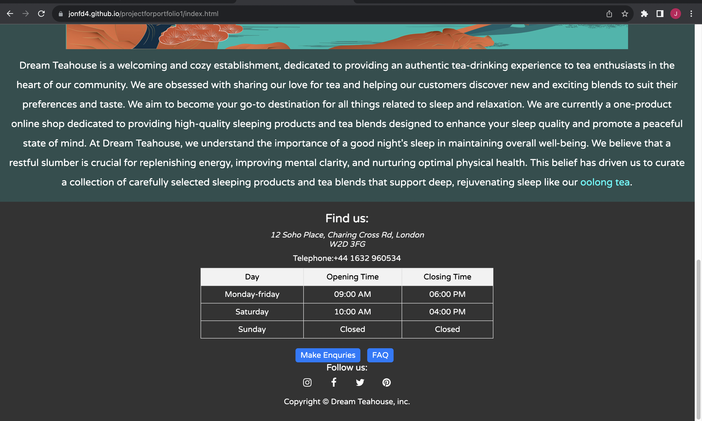
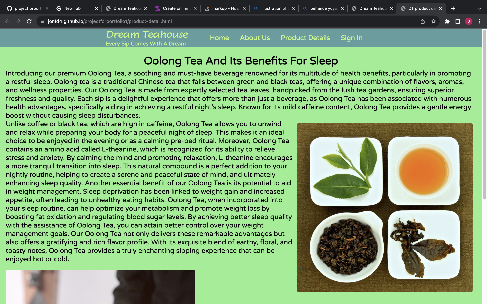
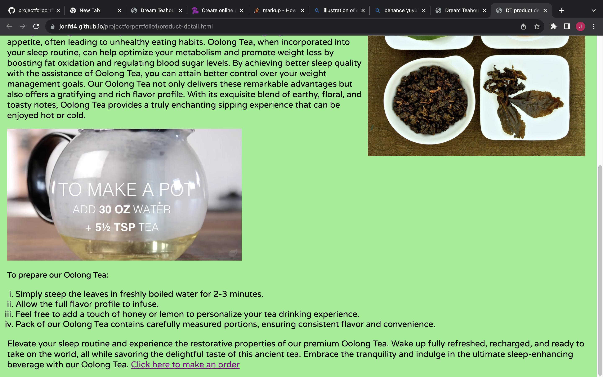
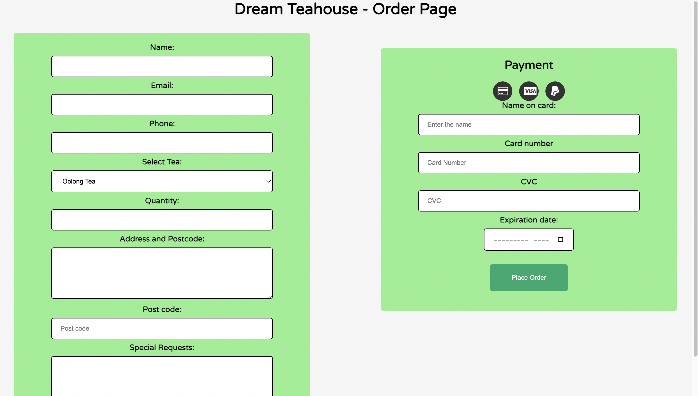
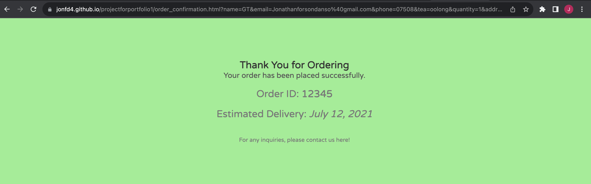
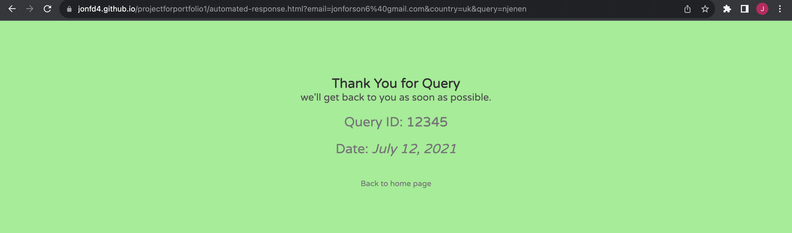
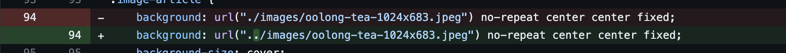
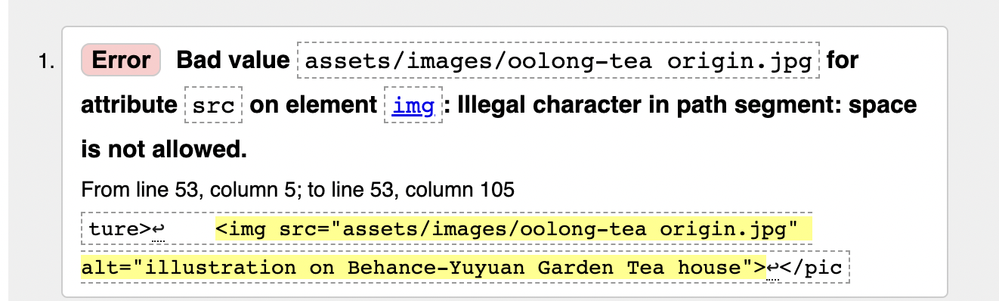
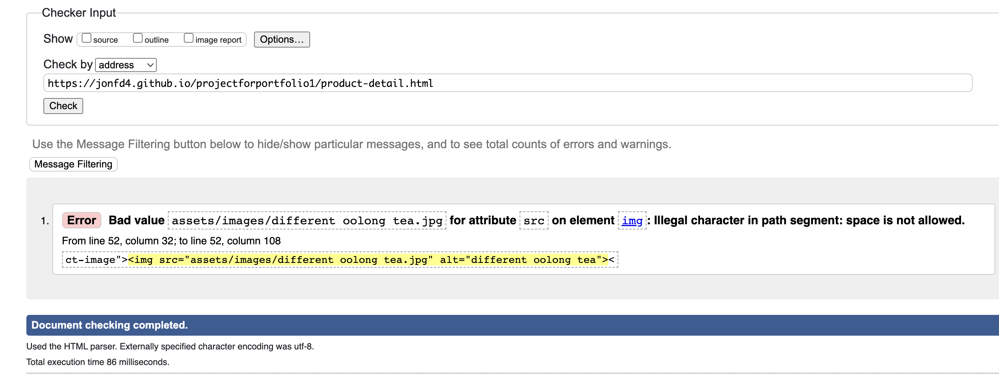

# Dream Teahouse

Dream teahouse is a website for the sales of oolong tea. It targets individuals interested in tea, specifically, those who needs relaxation and assistance with sleep.

Users of this website will experience a smooth interaction in fidning whatever information they want such as the product details, information abdout the establishment, contact information

The website is a responsive one that is suitable for different devices. This responsivenes was implemented with consideration to the average screen sizes of a phone which is 414px.

## Features

The first page of the website (index.html) contains three sections. The homepage, the about-us section, and the footer.
  #### the home page- features

   * The  header includes the  company logo which when clicked directs user to the homepage and slogan
    - There is also the navigation bar which includes the home button, about us (internal link), product detail, and sign-in button.
    - It is also has a text "Welcome to dream tea house" and a button that directs user to product details
   
#### the about us which gives a description and aim of the

*  The about us has a heading clarifying its role in the website.
    - The image of behance Yuyan river is an illustration from https://mir-s3-cdn-cf.behance.net/project_modules/1400/692f4385070277.5d709e57b7d93.jpg It serves to add aesthetic to the website.
    - It has descriptive text detailing the purpose and aim of the commpany.
    - It also has a button that directs user to product details.

* The footer

  - The footer  contains information about opening and closing times
  - Buttons for frequently asked questions as well as contact which will send user to a contact page.
  - There buttons for social media which when hovered over shows colours representive of them.

  This page maintains a contract between foreground and background allowing for user to be able to easily read whilst maintaing aesthetics.

#### The Product detail page

  - The page has the header which consists of the logo, slogan and navigation menu
  - This page is details researched information about oolong tea.
  - It also has an image of oolong tea and a youtube video show how to brew tea.
  - Underneath the video is sub-heading and a list of instructions.
  - there is a click button highlighted in purple that directs the user to order page.

#### Order page and order confirmation

 - The order page has the heading describing the purpose of the page and a home button to send user back to home page if they change their mind.
 - It has a form that strictly collects name, email, phone, tea choice and quantity, address and postcode and thenn payment details.
 - The place order button when clicked without all the forms being filled will inform the user of the necessity of completing the form.
 - The payment section includes forms for card name, card number, cvc and expiry date.
    -  It also has payment icons to allow user to choose method of payment. 
    -  When the button is clicked, after form is filled, the user is directed to the order confirmation page.
 - The order confirmation page will display some text including order id.
 - "contact here" is a link that directs user to contact page.

 #### Contact page and automated response
 
 
 - The contact page has a heading and paragraph that encourages user to contact the customer services for assistance
 - The contact page has a form that collects name and email, country, and query of the user. 
 - If the user completes the form and clicks on send button, the user is directed to a response page.
 - The response page has text to reasure user and a back to home button.

## Testing
I confirm that:
  - The function of this website was tested in chrome and safari.
  - Based on resizing in chromedevtools, the website on different screen sizes looks good.
  - The navigation, links and text throught out the website pages are all readable and easy to understand because of contrast.
  - Forms used have require attributes to demand necessary information from user.
  - Aria-label has been used on links and buttons to improve accessibility for screen readers.

### Bugs (solved bugs)
Deploying my website on github has shown a lot of issues which did not exist when I was coding on my vs code on my laptop.
 Note:_I had to use my vs code instead of codeanywhere due to several challenges which were hindering my progress:
 - The codeanywhere was not loading quickly.
 -  My commits not being pushed to github.
 - codes not being rendered properly. I tested them on other online IDEs such as codepen, stack overflow and w3 school.
 - Terminal not being responsive.
 _
* My images when not showing despite using relative paths in both css and html.
for example:

 placing .. helped fix as can be seen in the image.
 * CSS was also not working despite  links being in a relative path
 
 This was fixed removing the very first backslah.

### Validator testing
A few errors were found. Mostly pertaining to bad coding practices such as closing tags. 
 These were fixed. Adding html end tag label extension made it easier for identification of closing tags by labelling them with selector attributes.

 * Index html validation:
 
 the image shows an error for image path in about us section. 
 However, this error has not been fixed bceause it seems that this is the only way github is able to render the image
 * Product details validation
 
 the image above shows an error with  relative path for image, however, this path seems effective in image being rendered on website.
 * No other errors were found using  html validator

 * CSS jigsaw validation: No errors were found

##### Lighthouse Analysis

Some of my websites performance were ranging from 77 to 82. For these analysis, showed the problem was a cumulative layout shift whereby as page loads some of the elements shifts.
    * No bugs were fixed on this.

Accessibility had hire scores through out the web pages as it was a main focus.
I can confirm  usability for screen readers,readability, colour contrast, user control and freedom were call onsidered in the development of the website. The website was analysed using lighthouse.
